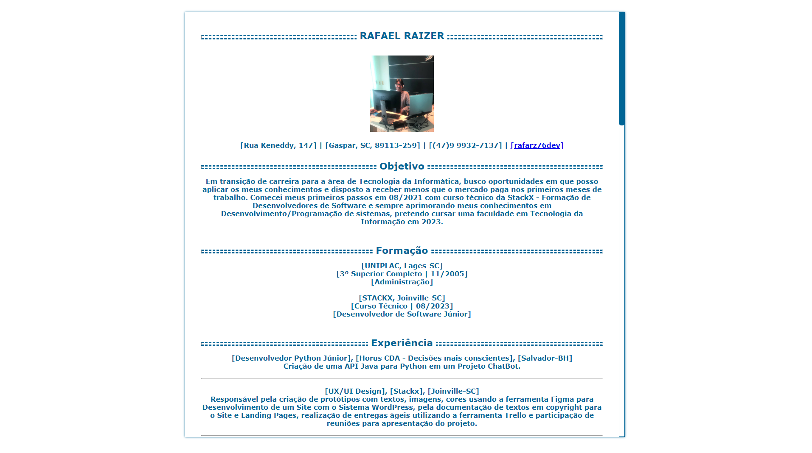

---

 
---

#  Venho aqui apresentar

# Desafios da Stackx no Módulo Essencial II:

## "1º Desafio  Iniciar a criação do currículo utilizando o Html."

### Hierarquias de títulos:

🎯 Altere o favicon ( de sua escolha );

🎯 Titulo, Subtítulo , descrições, , etc ...

🎯 Parágrafos como objetivos;

🎯 Deve conter uma linha separando o Titulo do restante do parágrafos;

🎯 Ter um paragrafo com informações sobre você e suas experiencias profissionais;

🎯 Lista ordenada dos trabalhos que já fez;

🎯 Um paragrafo com informações de seus estudos: ( uma quebra de linha).
 
## "2º Desafio  A partir da criação do currículo em HTML , agora chegou a vez de estilizar e aprimorar o currículo criado no sub módulo anterior utilizando o CSS com algumas propriedades, pseudo-elementos, pseudo-classe:"
 
🎯 Margin  Define a área de margem nos quatro lados do elemento;
 
🎯 Padding  Define uma distância entre o conteúdo de um elemento e suas bordas;
 
🎯 webkit-scrollbar  Defini a largura da barra de rolagem;
 
🎯 webkit-scrollbar-thumb  Define a barra arrastável de rolagem;
 
🎯 hover  Adicionando essa funcionalidade de interação como exemplo(o usuário passa o cursor do mouse sobre o elemento). 

  

### [Clique aqui para acessar o Projeto](https://raizertechdev-curriculo.netlify.app/)

---

    
  
***
### 😀👀 Bora conhecer o projeto....

### Gostou, então já clica na 🌟
